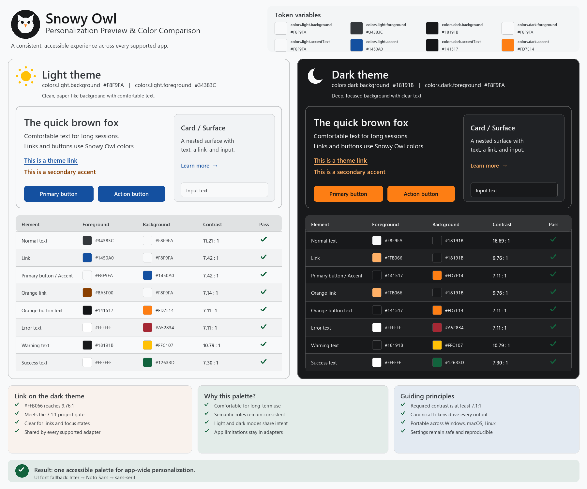

# Snowy Owl

[DRAFT VERSION]

A portable personalization system for development tools and applications, built
around a comfortable paper-white light theme, a soft dark theme, accessible
semantic colors, and consistent typography.

## Supported apps

| App | Operating systems | Delivery | Install |
| --- | --- | --- | --- |
| VS Code | Windows, macOS, Linux | Light/dark VSIX | `pwsh ./install.ps1 -App vscode` |
| Warp | Windows, macOS, Linux | Light/dark YAML | `pwsh ./install.ps1 -App warp` |
| Slack | Windows, macOS, Linux | Guided custom colors | `pwsh ./install.ps1 -App slack` |
| Codex desktop | Windows, macOS; not Linux | Desktop config | `pwsh ./install.ps1 -App codex` |
| Windows Terminal | Windows only | Schemes and font | `pwsh ./install.ps1 -App windows-terminal` |
| PowerShell | Windows, macOS, Linux | PSReadLine colors | `pwsh ./install.ps1 -App powershell` |
| Obsidian | Windows, macOS, Linux | CSS snippet and fonts | `pwsh ./install.ps1 -App obsidian -ObsidianVault <path>` |

Install PowerShell 7, clone the repository or download the portable release,
then run `pwsh ./install.ps1 -Check`. Run `pwsh ./install.ps1 -App all` to apply
every adapter supported by the current operating system. Unsupported adapters
are skipped with their supported OS list. Obsidian still needs a vault path.

Install the preferred fonts for the current user with
`pwsh ./scripts/install-fonts.ps1`, or install them before personalization with
`pwsh ./install.ps1 -InstallFonts -App all`. Downloads are pinned to an exact
Google Fonts revision and verified with SHA-256 before installation.

Before applying font-related personalization, installers select the first
installed preferred font. If none is detected, installation continues with the
app or system fallback and prints a warning. Fonts are downloaded only when
`-InstallFonts` or `scripts/install-fonts.ps1` is explicitly invoked.
Installers use supported configuration surfaces and do not patch binaries.

## Design baseline

- Light: `#F8F9FA` / `#18191B`
- Dark: `#18191B` / `#F8F9FA`
- Blue: `#1450A0` light, `#74A8F4` dark
- Orange link: `#8A3F00` light, `#FFB066` dark
- Orange accent/button: `#FD7E14`, foreground `#141517`
- Error `#A52834`; Warning `#FFC107`; Success `#12633D`
- UI font: Inter → Noto Sans → system
- Monospace: JetBrains Mono → Cascadia Mono → Consolas → system monospace
- Project text contrast floor: **7.1:1**

## Development

Start with [AGENTS.md](AGENTS.md), then read only the task-specific document it
links. `tokens/` and app adapters are source; generated output must not be
edited directly. See [Architecture](docs/ARCHITECTURE.md),
[AI workflow](docs/AI-WORKFLOW.md), and
[dashboard maintenance](docs/REPORTING.md).

Run `./scripts/build.ps1 -All -Html` to generate `docs/index.html`, including
contrast results, token usage, color samples, and typography details.

Run `./scripts/update-docs.ps1 -Html` to refresh the preview, accessibility
reports, token reference, and HTML dashboard without building application
packages.

Use `./scripts/update-docs.ps1 -Html -SkipValidation` only for visual report
debugging; the generated dashboard is marked as unvalidated.

Install development dependencies with `python -m pip install .`. Cross-file token aliases use
`{namespace.path}` references and are resolved before validation and generation.

Development uses feature branches and PRs into `main`. CI validates every PR and
merge. Versioned tags (`vX.Y.Z`) create downloadable GitHub Releases; no release
branch is required.
